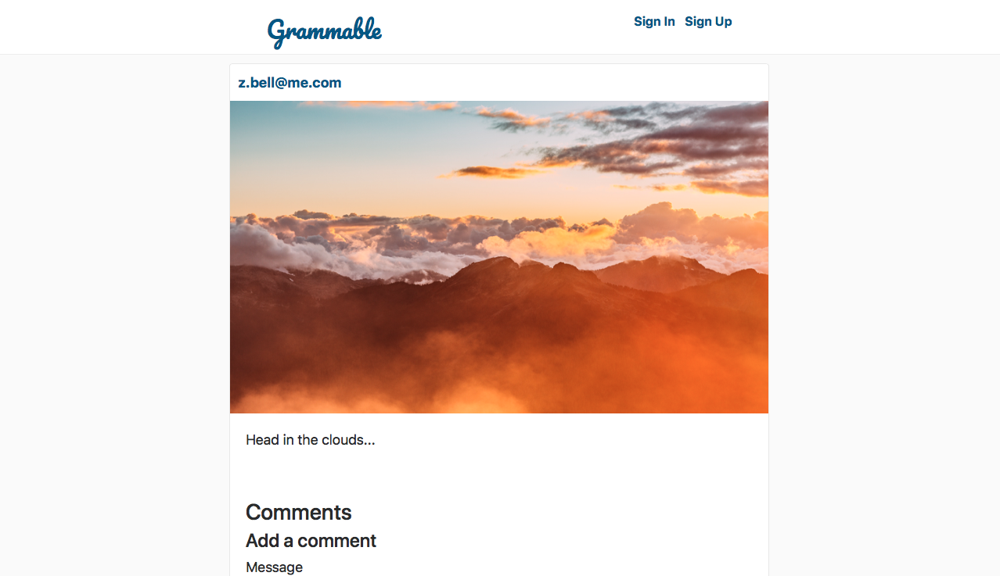

# Grammable

An Instagram clone built using Test Driven Development. Implements picture uploading to cloud storage, user management via Carrierwave, and commenting from other users.

## Built With

* Ruby on Rails 5.2.3
* Ruby 2.5.3
* AWS S3 Storage

## Gems

* [Devise](https://github.com/heartcombo/devise) - User management and authentication
* [Carrierwave](https://github.com/carrierwaveuploader/carrierwave) and [MiniMagick](https://github.com/minimagick/minimagick) - Media uploading 
* [rspec](https://github.com/rspec/rspec-rails) - Testing framework
* [Factory Bot](https://github.com/thoughtbot/factory_bot_rails) - Test data generator

## Acknowledgments

* [The Firehose Project](https://thefirehoseproject.com)
